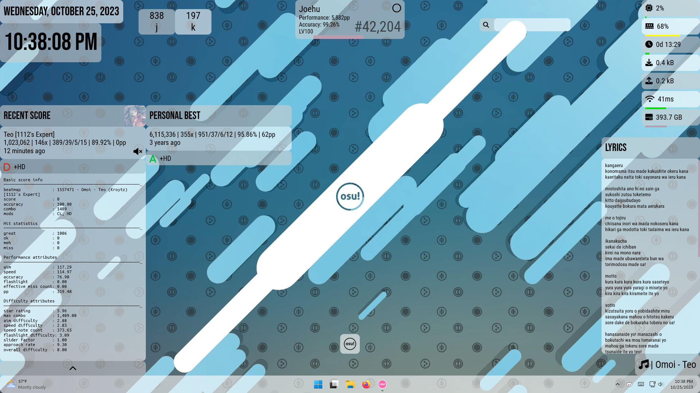

# uhe osu! extension

**This skin needs the [uhe suite](https://github.com/uhe-org/uhe) in the same `Rainmeter/Skins` folder to work correctly.**

osu!-related skins for the uhe Rainmeter suite

Desktop with light mode:

Desktop with dark mode:

*Wallpaper source (Wallpaper Engine): [New osu! Background (1080p 60 fps)](https://steamcommunity.com/sharedfiles/filedetails/?id=962079655) (2017)*\
*Layout: "uhe osu! Layout"*

## Dependencies

Some skins rely on external plugins / software. All Rainmeter plugins listed below are packaged in the `.rmskin` or uhe's `.rmskin`.

- osu! scorecards (Best/Recent)
    - Speech ([Rainmeter Forums](https://forum.rainmeter.net/viewtopic.php?f=18&t=31161&p=158239)) ([GitHub Repo](https://github.com/jsmorley/PluginSpeech))
    - [osu-tools (CLI)](https://github.com/ppy/osu-tools)
        - needs to be in `Documents/GitHub`
- KeyCounter
    - HotKey ([Rainmeter Forums](https://forum.rainmeter.net/viewtopic.php?t=18849)) ([GitHub Repo](https://github.com/brianferguson/HotKey.dll))
