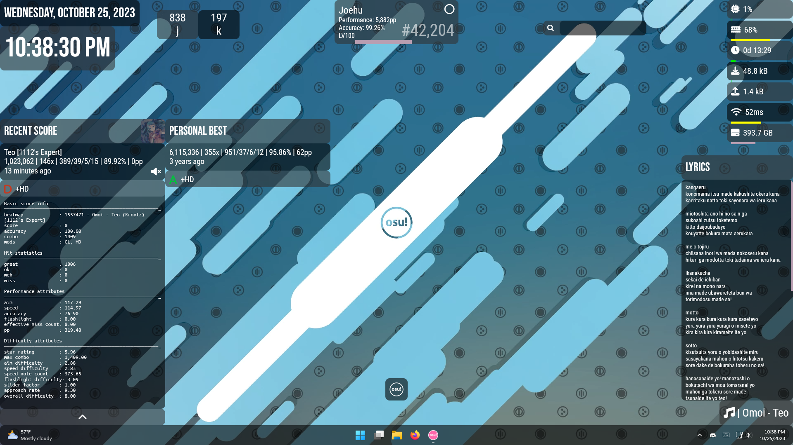

# uhe osu! extension

> [!NOTE]  
> This skin needs the [uhe suite](https://github.com/uhe-org/uhe) in the same `Rainmeter/Skins` folder to work correctly.

osu!-related skins for the uhe Rainmeter suite

Supports light/dark mode:

<picture>
  <source media="(prefers-color-scheme: dark)" srcset="assets/desktop-dark.png">
  <source media="(prefers-color-scheme: light)" srcset="assets/desktop-light.png">
  
</picture>

*Wallpaper source (Wallpaper Engine): [New osu! Background (1080p 60 fps)](https://steamcommunity.com/sharedfiles/filedetails/?id=962079655) (2017)*\
*Layout: "uhe osu! Layout"*

## Dependencies

Some skins rely on external plugins / software. All Rainmeter plugins listed below are packaged in the `.rmskin` or uhe's `.rmskin`.

- osu! scorecards (Best/Recent)
    - Speech ([Rainmeter Forums](https://forum.rainmeter.net/viewtopic.php?f=18&t=31161&p=158239)) ([GitHub Repo](https://github.com/jsmorley/PluginSpeech))
    - [osu-tools (CLI)](https://github.com/ppy/osu-tools)
        - needs to be in `Documents/GitHub`
- KeyCounter
    - HotKey ([Rainmeter Forums](https://forum.rainmeter.net/viewtopic.php?t=18849)) ([GitHub Repo](https://github.com/brianferguson/HotKey.dll))

## Development

This repo is structured in a way to automate releases, but there is no way to have multiple custom skins folders in Rainmeter. It makes developing in real time not possible by default, and symlinking has to be done. For example in PowerShell as admin:

```powershell
New-Item -Path "$([Environment]::GetFolderPath("MyDocuments"))\Rainmeter\Skins\uhe-osu-extension" -ItemType SymbolicLink -Value "$([Environment]::GetFolderPath("MyDocuments"))\GitHub\uhe-osu-extension\RMSKIN\Skins\uhe-osu-extension"
```
